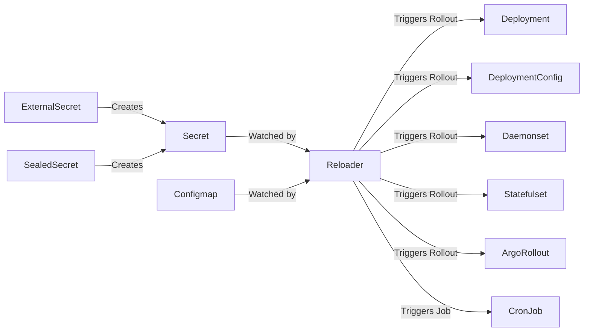

<p align="center">
  
</p>

[](https://goreportcard.com/report/github.com/stakater/reloader)
[](https://godoc.org/github.com/stakater/reloader)
[](https://github.com/stakater/reloader/releases/latest)
[](https://github.com/stakater/reloader/releases/latest)
[](https://hub.docker.com/r/stakater/reloader/)
[](https://hub.docker.com/r/stakater/reloader/)
[](LICENSE)
[](https://stakater.com/?utm_source=Reloader&utm_medium=github)

## 🔁 What is Reloader?

Reloader is a Kubernetes controller that automatically triggers rollouts of workloads (like Deployments, StatefulSets, and more) whenever referenced `Secrets` or `ConfigMaps` are updated.

In a traditional Kubernetes setup, updating a `Secret` or `ConfigMap` does not automatically restart or redeploy your workloads. This can lead to stale configurations running in production, especially when dealing with dynamic values like credentials, feature flags, or environment configs.

Reloader bridges that gap by ensuring your workloads stay in sync with configuration changes — automatically and safely.

## 🚀 Why Reloader?

- ✅ **Zero manual restarts**: No need to manually rollout workloads after config/secret changes.
- 🔒 **Secure by design**: Ensure your apps always use the most up-to-date credentials or tokens.
- 🛠️ **Flexible**: Works with all major workload types — Deployment, StatefulSet, Daemonset, ArgoRollout, and more.
- ⚡ **Fast feedback loop**: Ideal for CI/CD pipelines where secrets/configs change frequently.
- 🔄 **Out-of-the-box integration**: Just label your workloads and let Reloader do the rest.

## 🔧 How It Works



- Sources like `ExternalSecret` or `SealedSecret` create or manage your Kubernetes Secrets.
- `Secrets` and `ConfigMaps` are watched by Reloader.
- When changes are detected, Reloader automatically triggers a rollout of the associated workloads, ensuring your app always runs with the latest configuration.

## Enterprise Version

Reloader is available in two different versions:

1. Open Source Version
1. Enterprise Version, which includes:
   - SLA (Service Level Agreement) for support and unique requests
   - Slack support
   - Certified images

Contact [`sales@stakater.com`](mailto:sales@stakater.com) for info about Reloader Enterprise.

## Compatibility

Reloader is compatible with Kubernetes >= 1.19

## How to use Reloader

You have a `Deployment` called `foo` and a `ConfigMap` and/or a `Secret` either mounted as a volume or defined as a environment variable. The `ConfigMap` and `Secret` can be named whatever, but for the sake of this example, lets refer to the `ConfigMap` as `foo-configmap` and the secret as `foo-secret`.

Add the annotation to the main metadata of your `Deployment`. By default this would be `reloader.stakater.com/auto`.

```yaml
kind: Deployment
metadata:
  name: foo
  annotations:
    reloader.stakater.com/auto: "true"
spec:
  template:
    metadata:
```

This will discover deploymentconfigs/deployments/daemonsets/statefulset/rollouts/cronjobs/jobs automatically where `foo-configmap` or `foo-secret` is being used either via environment variable or from volume mount. And it will perform rolling upgrade on related pods when `foo-configmap` or `foo-secret`are updated.

You can filter it by the type of monitored resource and use typed versions of `auto` annotation. If you want to discover changes only in mounted `Secret`s and ignore changes in `ConfigMap`s, add `secret.reloader.stakater.com/auto` annotation instead. Analogously, you can use `configmap.reloader.stakater.com/auto` annotation to look for changes in mounted `ConfigMap`, changes in any of mounted `Secret`s will not trigger a rolling upgrade on related pods.

You can also restrict this discovery to only `ConfigMap` or `Secret` objects that
are tagged with a special annotation. To take advantage of that, annotate
your deploymentconfigs/deployments/daemonsets/statefulset/rollouts/cronjobs/jobs like this:

```yaml
kind: Deployment
metadata:
  annotations:
    reloader.stakater.com/search: "true"
spec:
  template:
```

and Reloader will trigger the rolling upgrade upon modification of any
`ConfigMap` or `Secret` annotated like this:

```yaml
kind: ConfigMap
metadata:
  annotations:
    reloader.stakater.com/match: "true"
data:
  key: value
```

provided the secret/configmap is being used in an environment variable, or a
volume mount.

Please note that `reloader.stakater.com/search` and
`reloader.stakater.com/auto` do not work together. If you have the
`reloader.stakater.com/auto: "true"` annotation on your deployment, then it
will always restart upon a change in configmaps or secrets it uses, regardless
of whether they have the `reloader.stakater.com/match: "true"` annotation or
not.

Similarly, `reloader.stakater.com/auto` and its typed version (`secret.reloader.stakater.com/auto` or `configmap.reloader.stakater.com/auto`) do not work together. If you have both annotations in your deployment, then only one of them needs to be true to trigger the restart. For example, having both `reloader.stakater.com/auto: "true"` and `secret.reloader.stakater.com/auto: "false"` or both `reloader.stakater.com/auto: "false"` and `secret.reloader.stakater.com/auto: "true"` will restart upon a change in a secret it uses.

We can also specify a specific configmap or secret which would trigger rolling upgrade only upon change in our specified configmap or secret, this way, it will not trigger rolling upgrade upon changes in all configmaps or secrets used in a `deploymentconfig`, `deployment`, `daemonset`, `statefulset`, `rollout`, `cronJob` or `job`.
To do this either set the auto annotation to `"false"` (`reloader.stakater.com/auto: "false"`) or remove it altogether, and use annotations for [Configmap](.#Configmap) or [Secret](.#Secret).

It's also possible to enable auto reloading for all resources, by setting the `--auto-reload-all` flag.
In this case, all resources that do not have the auto annotation (or its typed version) set to `"false"`, will be reloaded automatically when their Configmaps or Secrets are updated.
Notice that setting the auto annotation to an undefined value counts as false as-well.

### Configmap

To perform rolling upgrade when change happens only on specific configmaps use below annotation.

For a `Deployment` called `foo` have a `ConfigMap` called `foo-configmap`. Then add this annotation to main metadata of your `Deployment`

```yaml
kind: Deployment
metadata:
  annotations:
    configmap.reloader.stakater.com/reload: "foo-configmap"
spec:
  template:
    metadata:
```

Use comma separated list to define multiple configmaps.

```yaml
kind: Deployment
metadata:
  annotations:
    configmap.reloader.stakater.com/reload: "foo-configmap,bar-configmap,baz-configmap"
spec:
  template:
    metadata:
```

### Secret

To perform rolling upgrade when change happens only on specific secrets use below annotation.

For a `Deployment` called `foo` have a `Secret` called `foo-secret`. Then add this annotation to main metadata of your `Deployment`

```yaml
kind: Deployment
metadata:
  annotations:
    secret.reloader.stakater.com/reload: "foo-secret"
spec:
  template:
    metadata:
```

Use comma separated list to define multiple secrets.

```yaml
kind: Deployment
metadata:
  annotations:
    secret.reloader.stakater.com/reload: "foo-secret,bar-secret,baz-secret"
spec:
  template:
    metadata:
```

### NOTES

- Reloader also supports [sealed-secrets](https://github.com/bitnami-labs/sealed-secrets). [Here](docs/Reloader-with-Sealed-Secrets.md) are the steps to use sealed-secrets with Reloader.
- For [`rollouts`](https://github.com/argoproj/argo-rollouts/) Reloader simply triggers a change is up to you how you configure the `rollout` strategy.
- `reloader.stakater.com/auto: "true"` will only reload the pod, if the configmap or secret is used (as a volume mount or as an env) in `DeploymentConfigs/Deployment/Daemonsets/Statefulsets/CronJobs/Jobs`
- `secret.reloader.stakater.com/reload` or `configmap.reloader.stakater.com/reload` annotation will reload the pod upon changes in specified configmap or secret, irrespective of the usage of configmap or secret.
- you may override the auto annotation with the `--auto-annotation` flag
- you may override the secret typed auto annotation with the `--secret-auto-annotation` flag
- you may override the configmap typed auto annotation with the `--configmap-auto-annotation` flag
- you may override the search annotation with the `--auto-search-annotation` flag
  and the match annotation with the `--search-match-annotation` flag
- you may override the configmap annotation with the `--configmap-annotation` flag
- you may override the secret annotation with the `--secret-annotation` flag
- you may want to prevent watching certain namespaces with the `--namespaces-to-ignore` flag
- you may want to watch only a set of namespaces with certain labels by using the `--namespace-selector` flag
- you may want to watch only a set of secrets/configmaps with certain labels by using the `--resource-label-selector` flag
- you may want to prevent watching certain resources with the `--resources-to-ignore` flag
- you can configure logging in JSON format with the `--log-format=json` option
- you can configure the "reload strategy" with the `--reload-strategy=<strategy-name>` option (details below)
- you can configure rollout reload strategy with `reloader.stakater.com/rollout-strategy` annotation, `restart` or `rollout` values are available (defaults to `rollout`)

## Reload Strategies

Reloader supports multiple "reload" strategies for performing rolling upgrades to resources. The following list describes them:

- **env-vars**: When a tracked `configMap`/`secret` is updated, this strategy attaches a Reloader specific environment variable to any containers referencing the changed `configMap` or `secret` on the owning resource (e.g., `Deployment`, `StatefulSet`, etc.). This strategy can be specified with the `--reload-strategy=env-vars` argument. Note: This is the default reload strategy.
- **annotations**: When a tracked `configMap`/`secret` is updated, this strategy attaches a `reloader.stakater.com/last-reloaded-from` pod template annotation on the owning resource (e.g., `Deployment`, `StatefulSet`, etc.). This strategy is useful when using resource syncing tools like ArgoCD, since it will not cause these tools to detect configuration drift after a resource is reloaded. Note: Since the attached pod template annotation only tracks the last reload source, this strategy will reload any tracked resource should its `configMap` or `secret` be deleted and recreated. This strategy can be specified with the `--reload-strategy=annotations` argument.

## Deploying to Kubernetes

You can deploy Reloader by following methods:

### Vanilla Manifests

You can apply vanilla manifests by changing `RELEASE-NAME` placeholder provided in manifest with a proper value and apply it by running the command given below:

```bash
kubectl apply -f https://raw.githubusercontent.com/stakater/Reloader/master/deployments/kubernetes/reloader.yaml
```

By default, Reloader gets deployed in `default` namespace and watches changes `secrets` and `configmaps` in all namespaces. Additionally, in the default Reloader deployment, the following resource limits and requests are set:

```yaml
resources:
  limits:
    cpu: 150m
    memory: 512Mi
  requests:
    cpu: 10m
    memory: 128Mi
```

Reloader can be configured to ignore the resources `secrets` and `configmaps` by passing the following arguments (`spec.template.spec.containers.args`) to its container:

| Argument                           | Description          |
| ---------------------------------- | -------------------- |
| `--resources-to-ignore=configMaps` | To ignore configmaps |
| `--resources-to-ignore=secrets`    | To ignore secrets    |

**Note:** At one time only one of these resource can be ignored, trying to do it will cause error in Reloader. Workaround for ignoring both resources is by scaling down the Reloader pods to `0`.

Reloader can be configured to only watch secrets/configmaps with one or more labels using the `--resource-label-selector` parameter. Supported operators are `!, in, notin, ==, =, !=`, if no operator is found the 'exists' operator is inferred (i.e. key only). Additional examples of these selectors can be found in the [Kubernetes Docs](https://kubernetes.io/docs/concepts/overview/working-with-objects/labels/#label-selectors).

**Note:** The old `:` delimited key value mappings are deprecated and if provided will be translated to `key=value`. Likewise, if a wildcard value is provided (e.g. `key:*`) it will be translated to the standalone `key` which checks for key existence.

These selectors can be combined, for example with:

```yaml
--resource-label-selector=reloader=enabled,key-exists,another-label in (value1,value2,value3)
```

Only configmaps or secrets labeled like the following will be watched:

```yaml
kind: ConfigMap
apiVersion: v1
metadata:
  labels:
    reloader: enabled
    key-exists: yes
    another-label: value1
```

Reloader can be configured to only watch namespaces labeled with one or more labels using the `--namespace-selector` parameter. Supported operators are `!, in, notin, ==, =, !=`, if no operator is found the 'exists' operator is inferred (i.e. key only). Additional examples of these selectors can be found in the [Kubernetes Docs](https://kubernetes.io/docs/concepts/overview/working-with-objects/labels/#label-selectors).

**Note:** The old `:` delimited key value mappings are deprecated and if provided will be translated to `key=value`. Likewise, if a wildcard value is provided (e.g. `key:*`) it will be translated to the standalone `key` which checks for key existence.

These selectors can be combined, for example with:

```yaml
--namespace-selector=reloader=enabled,test=true
```

Only namespaces labeled as below would be watched and eligible for reloads:

```yaml
kind: Namespace
apiVersion: v1
metadata:
  labels:
    reloader: enabled
    test: true
```

### Vanilla Kustomize

You can also apply the vanilla manifests by running the following command

```bash
kubectl apply -k https://github.com/stakater/Reloader/deployments/kubernetes
```

Similarly to vanilla manifests get deployed in `default` namespace and watches changes `secrets` and `configmaps` in all namespaces.

### Kustomize

You can write your own `kustomization.yaml` using ours as a 'base' and write patches to tweak the configuration.

```yaml
apiVersion: kustomize.config.k8s.io/v1beta1
kind: Kustomization

resources:
  - https://github.com/stakater/Reloader/deployments/kubernetes

namespace: reloader
```

### Helm Chart

The Reloader Helm chart is documented in the [chart README](./deployments/kubernetes/chart/reloader/README.md).

#### Additional Remarks

- Both `namespaceSelector` & `resourceLabelSelector` can be used together. If they are then both conditions must be met for the configmap or secret to be eligible to trigger reload events. (e.g. If a configmap matches `resourceLabelSelector` but `namespaceSelector` does not match the namespace the configmap is in, it will be ignored).
- At one time only one of the resources `ignoreConfigMaps` or `ignoreSecrets` can be ignored, trying to do both will cause error in helm template compilation
- Reloading of OpenShift (DeploymentConfig) and/or Argo `Rollouts` has to be enabled explicitly because it might not be always possible to use it on a cluster with restricted permissions
- `isOpenShift` Recent versions of OpenShift (tested on 4.13.3) require the specified user to be in an `uid` range which is dynamically assigned by the namespace. The solution is to unset the runAsUser variable via `deployment.securityContext.runAsUser=null` and let OpenShift assign it at install
- `reloadOnCreate` controls how Reloader handles secrets being added to the cache for the first time. If `reloadOnCreate` is set to true:
  1. Configmaps/secrets being added to the cache will cause Reloader to perform a rolling update of the associated workload
  1. When applications are deployed for the first time, Reloader will perform a rolling update of the associated workload
  1. If you are running Reloader in HA mode all workloads will have a rolling update performed when a new leader is elected
- `reloadOnDelete` controls how Reloader handles secrets being deleted. If `reloadOnDelete` is set to true:
  1. Configmaps/secrets being deleted will cause Reloader to perform a rolling update of the associated workload
- `serviceMonitor` will be removed in future releases of Reloader in favour of Pod monitor
- If `reloadOnCreate` is set to false:
  1. Updates to configmaps/secrets that occur while there is no leader will not be picked up by the new leader until a subsequent update of the configmap/secret occurs
  1. In the worst case the window in which there can be no leader is 15s as this is the LeaseDuration
- If `reloadOnDelete` is set to false:
  1. Deleting of configmaps/secrets has no effect to pods that references these resources.
- By default, `reloadOnCreate`, `reloadOnDelete` and `syncAfterRestart` are all set to false. All need to be enabled explicitly

## Help

### Documentation

The Reloader documentation can be viewed from [the doc site](https://docs.stakater.com/reloader/). The doc source is in the [docs](./docs/) folder.

### Have a question?

File a GitHub [issue](https://github.com/stakater/Reloader/issues).

### Talk to us on Slack

Join and talk to us on Slack for discussing Reloader:

[](https://slack.stakater.com/)
[](https://stakater-community.slack.com/messages/CC5S05S12)

## Contributing

### Bug Reports & Feature Requests

Please use the [issue tracker](https://github.com/stakater/Reloader/issues) to report any bugs or file feature requests.

### Developing

1. Deploy Reloader
1. Run `okteto up` to activate your development container
1. `make build`
1. `./Reloader`

PRs are welcome. In general, we follow the "fork-and-pull" Git workflow:

1. **Fork** the repo on GitHub
1. **Clone** the project to your own machine
1. **Commit** changes to your own branch
1. **Push** your work back up to your fork
1. Submit a **Pull request** so that we can review your changes

**NOTE:** Be sure to merge the latest from "upstream" before making a pull request!

## Release Processes

_Repository GitHub releases_: As requested by the community in [issue 685](https://github.com/stakater/Reloader/issues/685), Reloader is now based on a manual release process. Releases are no longer done on every merged PR to the main branch, but manually on request.

To make a GitHub release:

1. Code owners create a release branch `release-vX.Y.Z`
1. Code owners run a dispatch mode workflow to automatically generate version and manifests on the release branch
1. A PR is created to bump the image version on the release branch, example: [PR-798](https://github.com/stakater/Reloader/pull/798)
1. Code owners create a GitHub release with tag `vX.Y.Z` and target branch `release-vX.Y.Z`, which triggers creation of images
1. Code owners create a PR to update the Helm chart version, example: [PR-846](https://github.com/stakater/Reloader/pull/846)

_Repository git tagging_: Push to the main branch will create a merge-image and merge-tag named `merge-${{ github.event.number }}`, for example `merge-800` when pull request number 800 is merged.

## Changelog

View the [releases page](https://github.com/stakater/Reloader/releases) to see what has changed in each release.

## License

Apache2 © [Stakater][website]

## About

`Reloader` is maintained by [Stakater][website]. Like it? Please let us know at [hello@stakater.com](hello@stakater.com)

See [our other projects](https://github.com/stakater)
or contact us in case of professional services and queries on [hello@stakater.com](hello@stakater.com)

[website]: https://stakater.com

## Acknowledgements

- [ConfigmapController](https://github.com/fabric8io/configmapcontroller); We documented [here](docs/Reloader-vs-ConfigmapController.md) why we re-created Reloader
