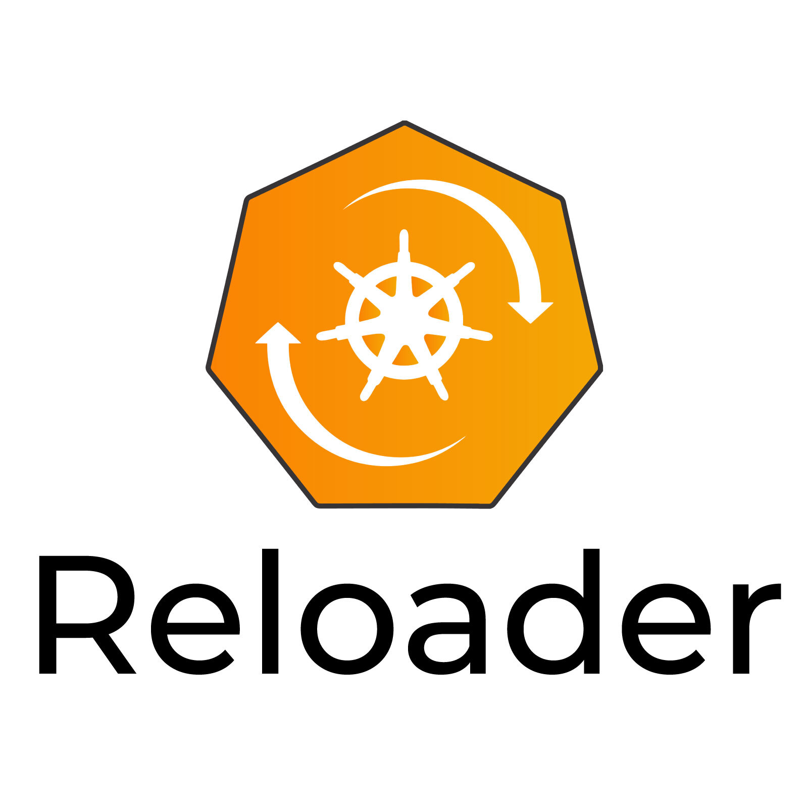
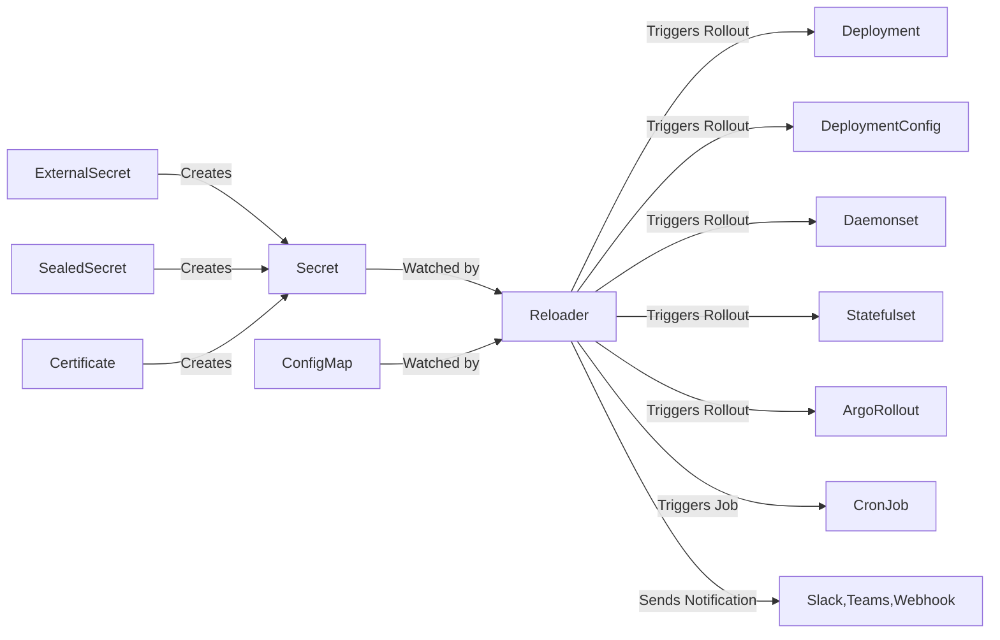

<p align="center">
  
</p>

[](https://goreportcard.com/report/github.com/stakater/reloader)
[](https://godoc.org/github.com/stakater/reloader)
[](https://github.com/stakater/reloader/releases/latest)
[](https://github.com/stakater/reloader/releases/latest)
[](https://hub.docker.com/r/stakater/reloader/)
[](https://hub.docker.com/r/stakater/reloader/)
[](LICENSE)

## 🔁 What is Reloader?

Reloader is a Kubernetes controller that automatically triggers rollouts of workloads (like Deployments, StatefulSets, and more) whenever referenced `Secrets` or `ConfigMaps` are updated.

In a traditional Kubernetes setup, updating a `Secret` or `ConfigMap` does not automatically restart or redeploy your workloads. This can lead to stale configurations running in production, especially when dealing with dynamic values like credentials, feature flags, or environment configs.

Reloader bridges that gap by ensuring your workloads stay in sync with configuration changes — automatically and safely.

## 🚀 Why Reloader?

- ✅ **Zero manual restarts**: No need to manually rollout workloads after config/secret changes.
- 🔒 **Secure by design**: Ensure your apps always use the most up-to-date credentials or tokens.
- 🛠️ **Flexible**: Works with all major workload types — Deployment, StatefulSet, Daemonset, ArgoRollout, and more.
- ⚡ **Fast feedback loop**: Ideal for CI/CD pipelines where secrets/configs change frequently.
- 🔄 **Out-of-the-box integration**: Just label your workloads and let Reloader do the rest.

## 🔧 How It Works?



- Sources like `ExternalSecret`, `SealedSecret`, or `Certificate` from `cert-manager` can create or manage Kubernetes `Secrets` — but they can also be created manually or delivered through GitOps workflows.
- `Secrets` and `ConfigMaps` are watched by Reloader.
- When changes are detected, Reloader automatically triggers a rollout of the associated workloads, ensuring your app always runs with the latest configuration.

## ⚡ Quick Start

### 1. Install Reloader

Follow any of this [installation options](#-installation).

### 2. Annotate Your Workload

To enable automatic reload for a Deployment:

```yaml
apiVersion: apps/v1
kind: Deployment
metadata:
  name: my-app
  annotations:
    reloader.stakater.com/auto: "true"
spec:
  template:
    metadata:
      labels:
        app: my-app
    spec:
      containers:
        - name: app
          image: your-image
          envFrom:
            - configMapRef:
                name: my-config
            - secretRef:
                name: my-secret
```

This tells Reloader to watch the `ConfigMap` and `Secret` referenced in this deployment. When either is updated, it will trigger a rollout.

## 🏢 Enterprise Version

Stakater offers an enterprise-grade version of Reloader with:

1. SLA-backed support
1. Certified images
1. Private Slack support

Contact [`sales@stakater.com`](mailto:sales@stakater.com) for info about Reloader Enterprise.

## 🧩 Usage

Reloader supports multiple annotation-based controls to let you **customize when and how your Kubernetes workloads are reloaded** upon changes in `Secrets` or `ConfigMaps`.

Kubernetes does not trigger pod restarts when a referenced `Secret` or `ConfigMap` is updated. Reloader bridges this gap by watching for changes and automatically performing rollouts — but it gives you full control via annotations, so you can:

- Reload **all** resources by default
- Restrict reloads to only **Secrets** or only **ConfigMaps**
- Watch only **specific resources**
- Use **opt-in via tagging** (`search` + `match`)
- Exclude workloads you don’t want to reload

### 1. 🔁 Automatic Reload (Default)

Use these annotations to automatically restart the workload when referenced `Secrets` or `ConfigMaps` change.

| Annotation                                 | Description                                                          |
|--------------------------------------------|----------------------------------------------------------------------|
| `reloader.stakater.com/auto: "true"`       | Reloads workload when any referenced ConfigMap or Secret changes     |
| `secret.reloader.stakater.com/auto: "true"`| Reloads only when referenced Secret(s) change                        |
| `configmap.reloader.stakater.com/auto: "true"`| Reloads only when referenced ConfigMap(s) change                  |

### 2. 📛 Named Resource Reload (Specific Resource Annotations)

These annotations allow you to manually define which ConfigMaps or Secrets should trigger a reload, regardless of whether they're used in the pod spec.

| Annotation                                          | Description                                                                          |
|-----------------------------------------------------|--------------------------------------------------------------------------------------|
| `secret.reloader.stakater.com/reload: "my-secret"`  | Reloads when specific Secret(s) change, regardless of how they're used              |
| `configmap.reloader.stakater.com/reload: "my-config"`| Reloads when specific ConfigMap(s) change, regardless of how they're used         |

#### Use when

1. ✅ This is useful in tightly scoped scenarios where config is shared but reloads are only relevant in certain cases.
1. ✅ Use this when you know exactly which resource(s) matter and want to avoid auto-discovery or searching altogether.

### 3. 🎯 Targeted Reload (Match + Search Annotations)

This pattern allows fine-grained reload control — workloads only restart if the Secret/ConfigMap is both:

1. Referenced by the workload
1. Explicitly annotated with `match: true`

| Annotation                                | Applies To   | Description                                                                 |
|-------------------------------------------|--------------|-----------------------------------------------------------------------------|
| `reloader.stakater.com/search: "true"`    | Workload     | Enables search mode (only reloads if matching secrets/configMaps are found) |
| `reloader.stakater.com/match: "true"`     | ConfigMap/Secret | Marks the config/secret as eligible for reload in search mode              |

#### How it works

1. The workload must have: `reloader.stakater.com/search: "true"`
1. The ConfigMap or Secret must have: `reloader.stakater.com/match: "true"`
1. The resource (ConfigMap or Secret) must also be referenced in the workload (via env, `volumeMount`, etc.)

#### Use when

1. ✅ You want to reload a workload only if it references a ConfigMap or Secret that has been explicitly tagged with `reloader.stakater.com/match: "true"`.
1. ✅ Use this when you want full control over which shared or system-wide resources trigger reloads. Great in multi-tenant clusters or shared configs.

### 4. ⚙️ Workload-Specific Rollout Strategy

By default, Reloader uses the **rollout** strategy — it updates the pod template to trigger a new rollout. This works well in most cases, but it can cause problems if you're using GitOps tools like ArgoCD, which detect this as configuration drift.

To avoid that, you can switch to the **restart** strategy, which simply restarts the pod without changing the pod template.

```yaml
metadata:
  annotations:
    reloader.stakater.com/rollout-strategy: "restart"
```

| Value              | Behavior                                                        |
|--------------------|-----------------------------------------------------------------|
| `rollout` (default) | Updates pod template metadata to trigger a rollout             |
| `restart`           | Deletes the pod to restart it without patching the template    |

✅ Use `restart` if:

1. You're using GitOps and want to avoid drift
1. You want a quick restart without changing the workload spec
1. Your platform restricts metadata changes

### 5. ❗ Annotation Behavior Rules & Compatibility

- `reloader.stakater.com/auto` and `reloader.stakater.com/search` **cannot be used together** — the `auto` annotation takes precedence.
- If both `auto` and its typed versions (`secret.reloader.stakater.com/auto`, `configmap.reloader.stakater.com/auto`) are used, **only one needs to be true** to trigger a reload.
- Setting `reloader.stakater.com/auto: "false"` explicitly disables reload for that workload.
- If `--auto-reload-all` is enabled on the controller:
    - All workloads are treated as if they have `auto: "true"` unless they explicitly set it to `"false"`.
    - Missing or unrecognized annotation values are treated as `"false"`.

### 6. 🔔 Alerting on Reload

Reloader can optionally **send alerts** whenever it triggers a rolling upgrade for a workload (e.g., `Deployment`, `StatefulSet`, etc.).

These alerts are sent to a configured **webhook endpoint**, which can be a generic receiver or services like Slack, Microsoft Teams or Google Chat.

To enable this feature, update the `reloader.env.secret` section in your `values.yaml` (when installing via Helm):

```yaml
reloader:
  env:
    secret:
      ALERT_ON_RELOAD: "true"                    # Enable alerting (default: false)
      ALERT_SINK: "slack"                        # Options: slack, teams, gchat or webhook (default: webhook)
      ALERT_WEBHOOK_URL: "<your-webhook-url>"    # Required if ALERT_ON_RELOAD is true
      ALERT_ADDITIONAL_INFO: "Triggered by Reloader in staging environment"
```

## 🚀 Installation

### 1. 📦 Helm

Reloader can be installed in multiple ways depending on your Kubernetes setup and preference. Below are the supported methods:

```bash
helm repo add stakater https://stakater.github.io/stakater-charts
helm repo update
helm install reloader stakater/reloader
```

➡️ See full Helm configuration in the [chart README](./deployments/kubernetes/chart/reloader/README.md).

### 2. 📄 Vanilla Manifests

Apply raw Kubernetes manifests directly:

```bash
kubectl apply -f https://raw.githubusercontent.com/stakater/Reloader/master/deployments/kubernetes/reloader.yaml
```

### 3. 🧱 Vanilla Kustomize

Use the built-in Kustomize support:

```bash
kubectl apply -k https://github.com/stakater/Reloader/deployments/kubernetes
```

### 4. 🛠️ Custom Kustomize Setup

You can create your own `kustomization.yaml` and use Reloader’s as a base:

```yaml
apiVersion: kustomize.config.k8s.io/v1beta1
kind: Kustomization

resources:
  - https://github.com/stakater/Reloader/deployments/kubernetes

namespace: reloader
```

### 5. ⚖️ Default Resource Requests and Limits

By default, Reloader is deployed with the following resource requests and limits:

```yaml
resources:
  limits:
    cpu: 150m
    memory: 512Mi
  requests:
    cpu: 10m
    memory: 128Mi
```

### 6. ⚙️ Optional runtime configurations

These flags let you customize Reloader's behavior globally, at the Reloader controller level.

#### 1. 🔁 Reload Behavior

| Flag | Description |
|------|-------------|
| `--reload-on-create=true` | Reload workloads when a watched ConfigMap or Secret is created |
| `--reload-on-delete=true` | Reload workloads when a watched ConfigMap or Secret is deleted |
| `--auto-reload-all=true` | Automatically reload all workloads unless opted out (`auto: "false"`) |
| `--reload-strategy=env-vars` | Strategy to use for triggering reload (`env-vars` or `annotations`) |
| `--log-format=json` | Enable JSON-formatted logs for better machine readability |

##### Reload Strategies

Reloader supports multiple strategies for triggering rolling updates when a watched `ConfigMap` or `Secret` changes. You can configure the strategy using the `--reload-strategy` flag.

| Strategy     | Description |
|--------------|-------------|
| `env-vars` (default) | Adds a dummy environment variable to any container referencing the changed resource (e.g., `Deployment`, `StatefulSet`, etc.). This forces Kubernetes to perform a rolling update. |
| `annotations` | Adds a `reloader.stakater.com/last-reloaded-from` annotation to the pod template metadata. Ideal for GitOps tools like ArgoCD, as it avoids triggering unwanted sync diffs. |

- The `env-vars` strategy is the default and works in most setups.
- The `annotations` strategy is preferred in **GitOps environments** to prevent config drift in tools like ArgoCD or Flux.
- In `annotations` mode, a `ConfigMap` or `Secret` that is deleted and re-created will still trigger a reload (since previous state is not tracked).

#### 2. 🚫 Resource Filtering

| Flag | Description |
|------|-------------|
| `--resources-to-ignore=configmaps` | Ignore ConfigMaps (only one type can be ignored at a time) |
| `--resources-to-ignore=secrets` | Ignore Secrets (cannot combine with configMaps) |
| `--resource-label-selector=key=value` | Only watch ConfigMaps/Secrets with matching labels |

> **⚠️ Note:**  
> Only **one** resource type can be ignored at a time.  
> Trying to ignore **both `configmaps` and `secrets`** will cause an error in Reloader.  
> ✅ **Workaround:** Scale the Reloader deployment to `0` replicas if you want to disable it completely.

#### 3. 🧩 Namespace Filtering

| Flag | Description |
|------|-------------|
| `--namespace-selector='key=value'` <br /> <br />`--namespace-selector='key1=value1,key2=value2'` <br /> <br />`--namespace-selector='key in (value1,value2)'`| Watch only namespaces with matching labels. See [LIST and WATCH filtering](https://kubernetes.io/docs/concepts/overview/working-with-objects/labels/#list-and-watch-filtering) for more details on label selectors |
| `--namespaces-to-ignore=ns1,ns2` | Skip specific namespaces from being watched |

#### 4. 📝 Annotation Key Overrides

These flags allow you to redefine annotation keys used in your workloads or resources:

| Flag | Overrides |
|------|-----------|
| `--auto-annotation` | Overrides `reloader.stakater.com/auto` |
| `--secret-auto-annotation` | Overrides `secret.reloader.stakater.com/auto` |
| `--configmap-auto-annotation` | Overrides `configmap.reloader.stakater.com/auto` |
| `--auto-search-annotation` | Overrides `reloader.stakater.com/search` |
| `--search-match-annotation` | Overrides `reloader.stakater.com/match` |
| `--secret-annotation` | Overrides `secret.reloader.stakater.com/reload` |
| `--configmap-annotation` | Overrides `configmap.reloader.stakater.com/reload` |

## Compatibility

Reloader is compatible with Kubernetes >= 1.19

## Help

### Documentation

The Reloader documentation can be viewed from [the doc site](https://docs.stakater.com/reloader/). The doc source is in the [docs](./docs/) folder.

### Have a question?

File a GitHub [issue](https://github.com/stakater/Reloader/issues).

### Talk to us on Slack

Join and talk to us on Slack for discussing Reloader:

[](https://slack.stakater.com/)
[](https://stakater-community.slack.com/messages/CC5S05S12)

## Contributing

### Bug Reports & Feature Requests

Please use the [issue tracker](https://github.com/stakater/Reloader/issues) to report any bugs or file feature requests.

### Developing

1. Deploy Reloader
1. Run `okteto up` to activate your development container
1. `make build`
1. `./Reloader`

PRs are welcome. In general, we follow the "fork-and-pull" Git workflow:

1. **Fork** the repo on GitHub
1. **Clone** the project to your own machine
1. **Commit** changes to your own branch
1. **Push** your work back up to your fork
1. Submit a **Pull request** so that we can review your changes

**NOTE:** Be sure to merge the latest from "upstream" before making a pull request!

## Release Processes

_Repository GitHub releases_: As requested by the community in [issue 685](https://github.com/stakater/Reloader/issues/685), Reloader is now based on a manual release process. Releases are no longer done on every merged PR to the main branch, but manually on request.

To make a GitHub release:

1. Code owners create a release branch `release-vX.Y.Z`
1. Code owners run a dispatch mode workflow to automatically generate version and manifests on the release branch
1. A PR is created to bump the image version on the release branch, example: [PR-798](https://github.com/stakater/Reloader/pull/798)
1. Code owners create a GitHub release with tag `vX.Y.Z` and target branch `release-vX.Y.Z`, which triggers creation of images
1. Code owners create a PR to update the Helm chart version, example: [PR-846](https://github.com/stakater/Reloader/pull/846)

_Repository git tagging_: Push to the main branch will create a merge-image and merge-tag named `merge-${{ github.event.number }}`, for example `merge-800` when pull request number 800 is merged.

## Changelog

View the [releases page](https://github.com/stakater/Reloader/releases) to see what has changed in each release.

## License

Apache2 © [Stakater][website]

## About Stakater

[](https://stakater.com/?utm_source=Reloader&utm_medium=github)

`Reloader` is maintained by [Stakater][website]. Like it? Please let us know at [hello@stakater.com](hello@stakater.com)

See [our other projects](https://github.com/stakater) or contact us in case of professional services and queries on [hello@stakater.com](hello@stakater.com)

[website]: https://stakater.com
