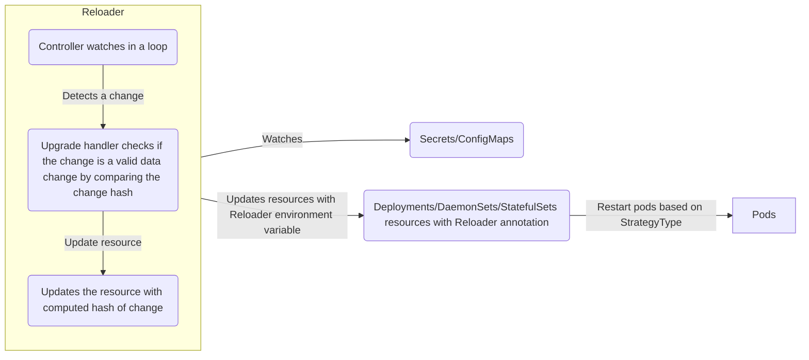

# How Does Reloader Work?

Reloader watches for `ConfigMap` and `Secret` and detects if there are changes in data of these objects. After change detection Reloader performs rolling upgrade on relevant Pods via associated `Deployment`, `Daemonset` and `Statefulset`:



## How Does Change Detection Work?

Reloader watches changes in `ConfigMaps` and `Secrets` data. As soon as it detects a change in these. It forwards these objects to an update handler which decides if and how to perform the rolling upgrade.

## Requirements for Rolling Upgrade

To perform rolling upgrade a `deployment`, `daemonset` or `statefulset` must have

- support for rolling upgrade strategy
- specific annotation for `ConfigMaps` or `Secrets`

The annotation value is comma separated list of `ConfigMaps` or `Secrets`. If a change is detected in data of these `ConfigMaps` or `Secrets`, Reloader will perform rolling upgrades on their associated `deployments`, `daemonsets` or `statefulsets`.

### Annotation for ConfigMap

For a `Deployment` called `foo` have a `ConfigMap` called `foo`. Then add this annotation* to your `Deployment`, where the default annotation can be changed with the `--configmap-annotation` flag:

```yaml
metadata:
  annotations:
    configmap.reloader.stakater.com/reload: "foo"
```

### Annotation for Secret

For a `Deployment` called `foo` have a `Secret` called `foo`. Then add this annotation to your `Deployment`, where the default annotation can be changed with the `--secret-annotation` flag:

```yaml
metadata:
  annotations:
    secret.reloader.stakater.com/reload: "foo"
```

Above mentioned annotation are also work for `Daemonsets` `Statefulsets` and `Rollouts`

## How Does Rolling Upgrade Work?

When Reloader detects changes in `ConfigMap`. It gets two objects of `ConfigMap`. First object is an old `ConfigMap` object which has a state before the latest change. Second object is new `ConfigMap` object which contains latest changes. Reloader compares both objects and see whether any change in data occurred or not. If Reloader finds any change in new `ConfigMap` object, only then, it moves forward with rolling upgrade.

After that, Reloader gets the list of all `deployments`, `daemonsets` and `statefulset` and looks for above mentioned annotation for `ConfigMap`. If the annotation value contains the `ConfigMap` name, it then looks for an environment variable which can contain the `ConfigMap` or secret data change hash.

### Environment Variable for ConfigMap

If `ConfigMap` name is foo then

```yaml
STAKATER_FOO_CONFIGMAP
```

### Environment Variable for Secret

If Secret name is foo then

```yaml
STAKATER_FOO_SECRET
```

If the environment variable is found then it gets its value and compares it with new `ConfigMap` hash value. If old value in environment variable is different from new hash value then Reloader updates the environment variable. If the environment variable does not exist then it creates a new environment variable with latest hash value from `ConfigMap` and updates the relevant `deployment`, `daemonset` or `statefulset`

Note: Rolling upgrade also works in the same way for secrets.

### Hash Value Computation

Reloader uses SHA1 to compute hash value. SHA1 is used because it is efficient and less prone to collision.

## Monitor All Namespaces

By default Reloader deploys in default namespace and monitors changes in all namespaces. To monitor changes in a specific namespace deploy the Reloader in that namespace and set the `watchGlobally` flag to `false` in values file located under `deployments/kubernetes/chart/reloader` and render manifest file using helm command:

```bash
helm --namespace {replace this with namespace name} template . > reloader.yaml
```

The output file can then be used to deploy Reloader in specific namespace.

## Compatibility With Helm Install and Upgrade

Reloader has no impact on helm deployment cycle. Reloader only injects an environment variable in  `deployment`, `daemonset` or `statefulset`. The environment variable contains the SHA1 value of `ConfigMaps` or `Secrets` data. So  if a deployment is created using Helm and Reloader updates the deployment, then next time you upgrade the helm release, Reloader will do nothing except changing that environment variable value in `deployment` , `daemonset` or `statefulset`.
